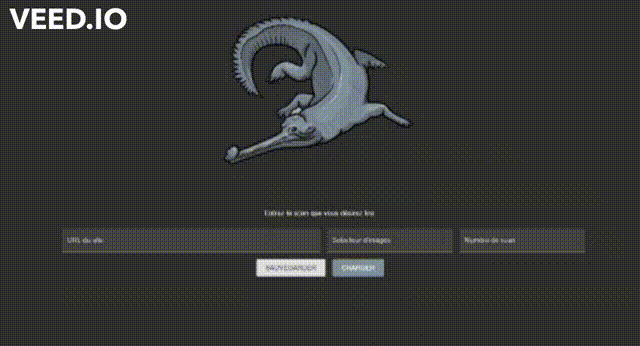

# Gavial : Un weeb de crawler 🐊

Gavial est une alternative permettant de lire des scans de Manga en faisant primer l'efficacité et le minimalisme.

## Utilisation

1. Entrer le lien de la page web contenant le scan en remplaçant le numéro du scan par `{number}`
2. Définissez le sélecteur HTML adéquat pour récupérer les attributs `src` des images du scan
3. Remplissez le numéro du scan souhaité
4. C'est parti 🤩
